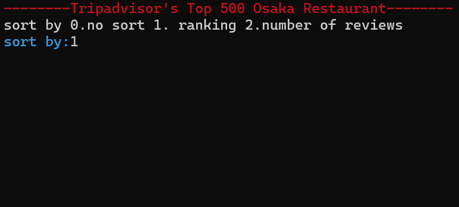
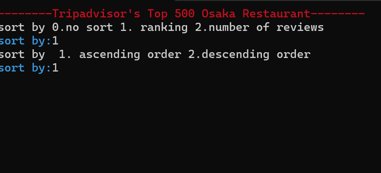
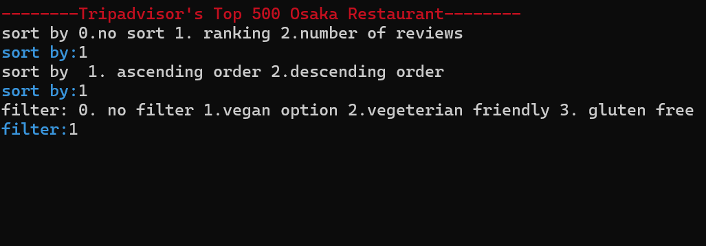
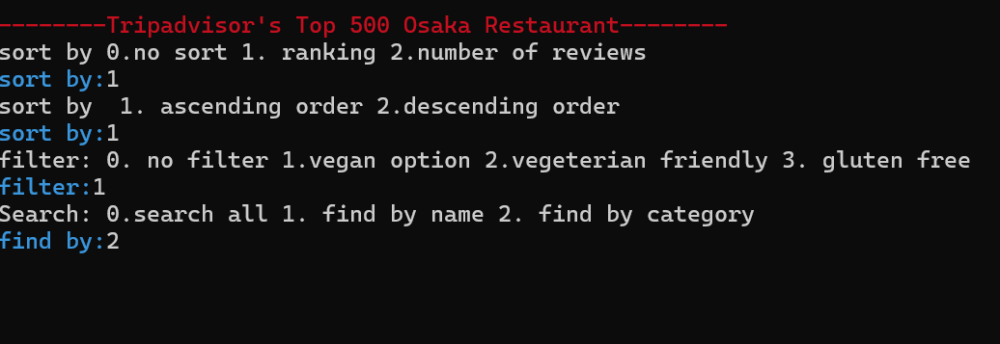
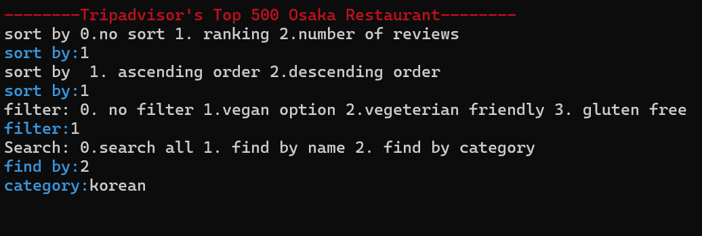
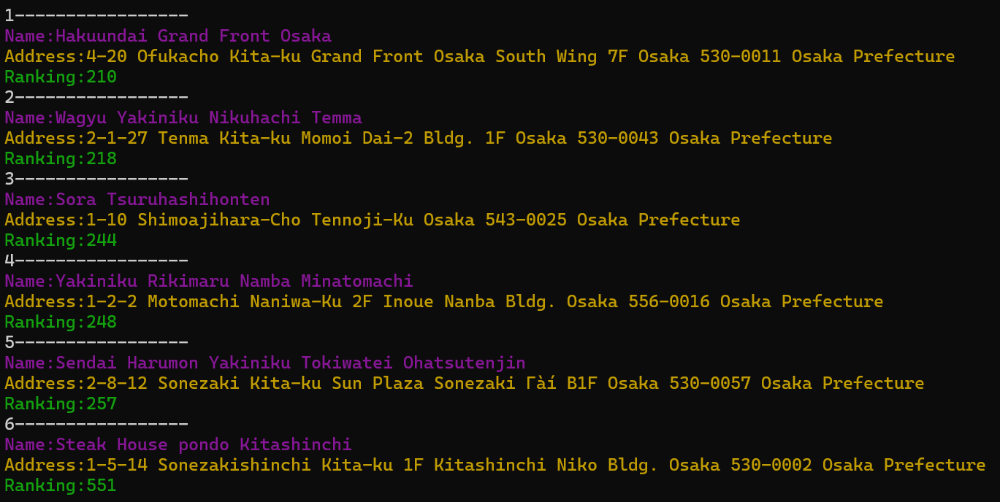

## Search through Tripadvisor's Top 500 Osaka Restaurants
***
#### About Project Osaka

+ Aimed to make a program that could process tabularized raw data similar to the pivot table from Microsoft Excel.
+ The goal was to create a more intuitive program than that of the pivot table.
+ Started the project on 04MAR24.

#### Development Environment

+ C++

#### Features

+ Filter Options—vegan, vegetarian friendly, gluten free and food category (Japanese, Korean, bar etc.).
+ Sort Data by raw ranking or number of reviews.
+ Displays restaurant's name, address, and ranking after searching.

### How to Use

  

+ type in 1 to sort by ranking, 2 to sort by number of reviews and 3 for no sorting.

  

+ type in 1 to sort in ascending order, 2 to sort in descending order.

  

+ type in 1 for vegan options, 2 for vegetarian friendly, 3 for gluten-free, and 0 for no filter.

  

+ type in 1 to search by name, 2 to search by category, and 0 to search all.

  

+ type in the name/category that you would like to look up. In this case, Korean food.

  

+ displays restaurants' names, addresses, and rankings with the filter/sorting applied in a designated order.

#### Notes

+ How I made the program: https://blog.naver.com/motorpoolpmcs/223383678830 (in Korean)

#### Reference

+ Raw data file url: https://www.kaggle.com/datasets/kanchana1990/osakas-top-500-dining-spots-tripadvisor

